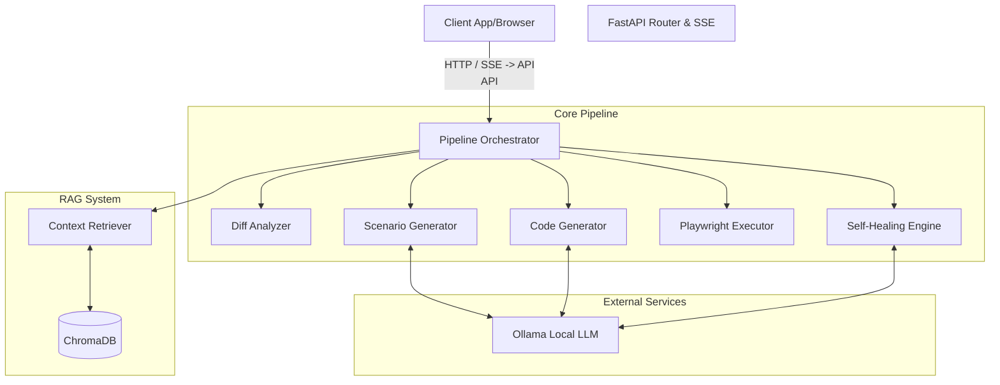
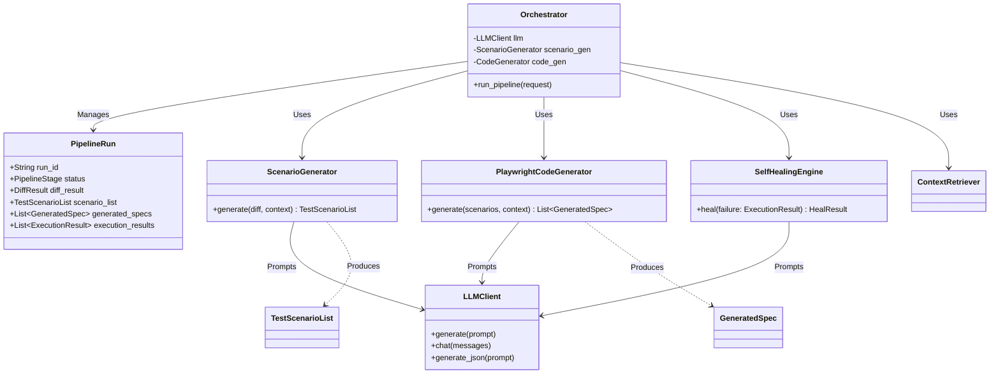
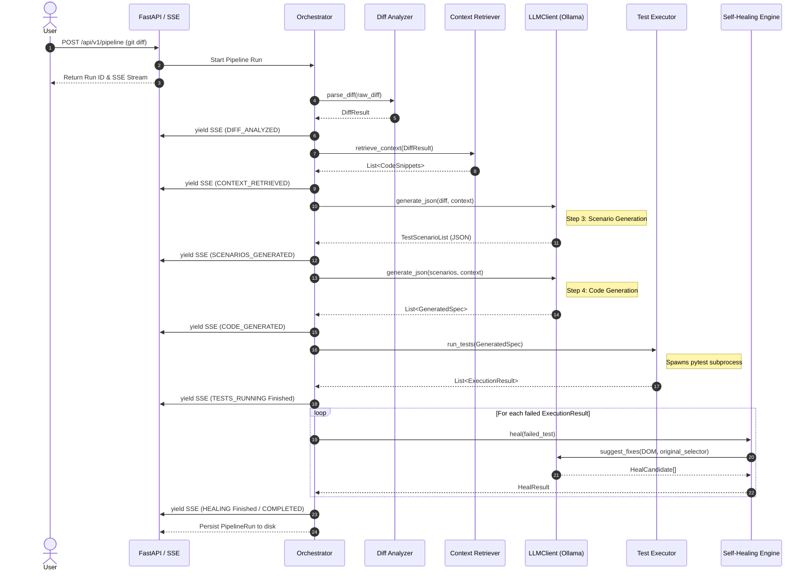

# AIQC Backend Architecture

The AIQC backend is an AI-driven Quality Assurance platform designed to automatically analyze git diffs, generate relevant Playwright test scenarios, write the corresponding test code, execute it, and attempt to self-heal any broken UI locators.

## 1. System Overview

The system runs as a Python-based FastAPI web application. It orchestrates a multi-step pipeline integrating local LLMs (via Ollama), a Vector Database (ChromaDB) for Retrieval-Augmented Generation (RAG), and a local Playwright execution environment.

## 2. Core Components

- **API & SSE (`app.api`)**: FastAPI application providing REST endpoints and Server-Sent Events (SSE) for real-time pipeline status updates.
- **Pipeline Orchestrator (`app.pipeline.orchestrator`)**: The controller that drives the sequential execution of the QA steps.
- **Diff Analyzer (`app.pipeline.diff_analyzer`)**: Parses git diffs to identify changed files, affected routes, and components.
- **RAG System (`app.rag`)**: Uses `ContextRetriever` and `VectorStore` (ChromaDB) to fetch relevant codebase context to inform the LLM about existing utilities or models.
- **Scenario & Code Generators (`app.pipeline.scenario_generator` & `code_generator`)**: Interfaces with the local LLM (`LLMClient`) to dynamically generate targeted JSON scenarios and format them into executable Playwright Pytest files.
- **Test Executor (`app.pipeline.executor`)**: Programmatically runs `pytest` on the generated Playwright specs and captures execution results.
- **Self-Healing Engine (`app.healing.healer`)**: Evaluates failing test execution results. Uses a two-tier approach (a fast heuristic `LocatorScorer` and an AI-assist fallback) to propose new operational selectors for broken locators.

## 3. Class Diagram

This diagram visualizes the main relationships between the core Pydantic domain models (`schemas.py`) and the primary processing classes.

## 4. Pipeline Execution Sequence

The `Orchestrator` triggers a sequential flow of dependent events, passing structured `Pydantic` schemas representing the result of one step to the input of the next.

## 5. Schema & Data Flow Structure

The backend makes extensive use of `Pydantic v2` to enforce strict contracts between the different lifecycle steps. The schemas act as the single source of truth for the data shapes generated by the LLM prompts and consumed by the processing components:

1. `PipelineRunRequest` ➔ `DiffResult`
2. `DiffResult` + `List[str]` (Context) ➔ `TestScenarioList`
3. `TestScenarioList` + `List[str]` ➔ `GeneratedSpec` (Playwright Test Files)
4. `GeneratedSpec` ➔ `ExecutionResult`
5. `ExecutionResult` (if failed) ➔ `HealResult` (AI/Heuristic healed locator)
