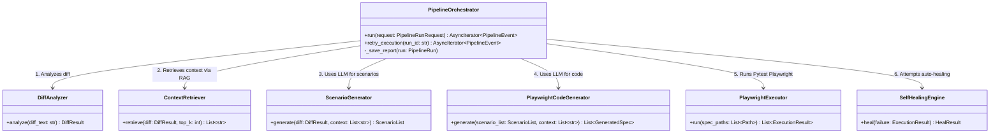
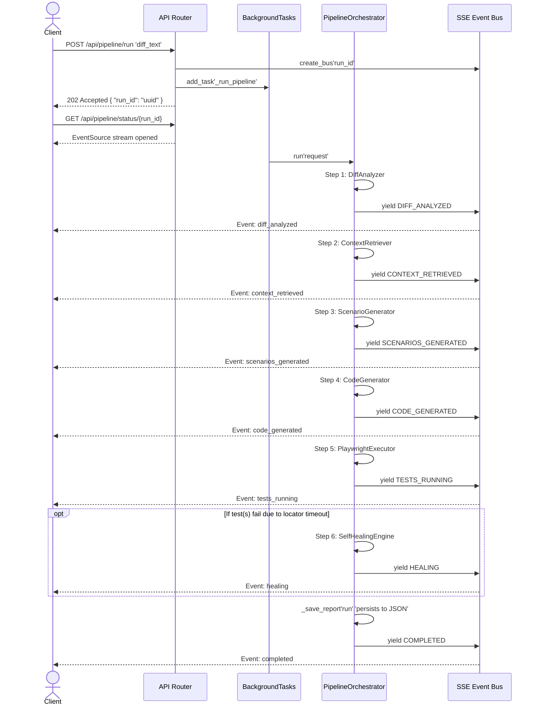
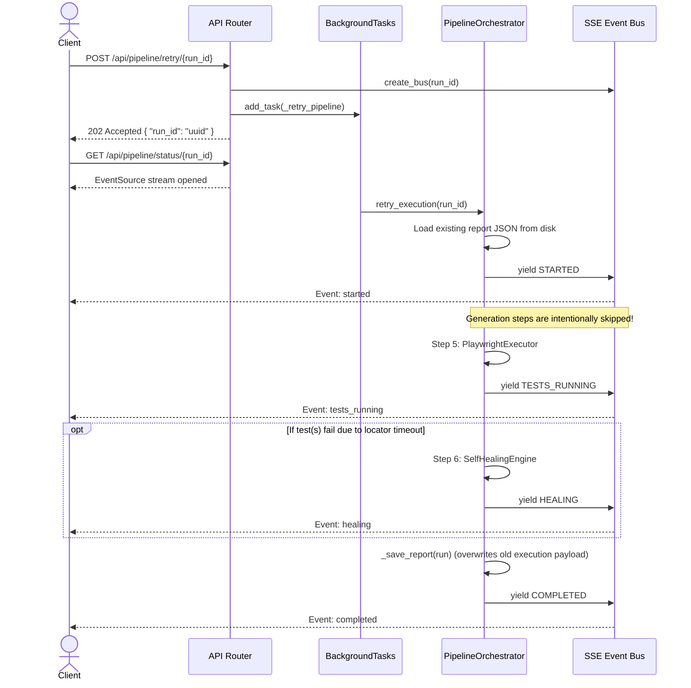

# AI-Driven QA Platform Architecture

This document outlines the architecture of the AI-Driven QA Platform, focusing on the `PipelineOrchestrator` and how it interacts with the rest of the system to process incoming code diffs, generate tests, execute them, and automatically heal broken locators.

## Core Component Diagram

The **PipelineOrchestrator** acts as a central director, ensuring the Single Responsibility Principle is followed by delegating distinct phases of test generation and execution to dedicated services. By using dependency injection, these components can be mocked during unit testing or updated independently.

---

## Standard Pipeline Run Sequence

The standard pipeline runs asynchronously via FastAPI's `BackgroundTasks`, communicating its real-time progress to the client via Server-Sent Events (SSE).

When a user submits a Git diff via the Frontend Dashboard, the backend immediately acknowledges the request (HTTP 202) and returns a unique `run_id`. The client uses this ID to open an EventSource connection, receiving a live stream as the orchestrator yields events stage-by-stage.

---

## Manual Retry Sequence

If a test fails due to unstable environments or LLM syntax errors, developers can directly fix the generated code on disk.

When the user clicks the "Retry" button on the UI, a parallel endpoint is triggered that skips the LLM generation (Steps 1 through 4) and directly executes the Playwright runner on the pre-existing files, maintaining the same `run_id`.

## System Resiliency and Persistence

- **Stateless Execution:** State during execution exists in memory, but at the end of the run it is persisted entirely into flat `.json` files in the `/data/reports` directory. By not relying on a strict relational datastore for run states, the architecture avoids complex data migration and makes manual inspection easy for developers.
- **SSE Fallbacks:** The Server-Sent Events architecture enables the Frontend to accurately trace status in real-time. If the browser disconnects during the stream, the orchestrator continues uninhibited mapping its findings to disk. Upon reconnecting, the React application reads the finished JSON blob from disk, ensuring no data loss on the frontend.
